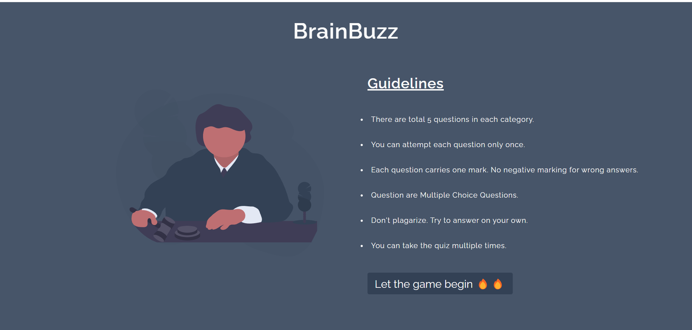

<p align="center">
  <a href="https://alcove-istebits.netlify.app/">
    
  </a>
</p>
<h1 align="center">
  BrainBuzz 🧠
</h1>


A dynamic, interactive quiz application built with HTML, CSS, and JavaScript that challenges users with diverse questions across general knowledge categories. 

## Features 🌟

- **Multiple Choice Questions**: Engaging MCQs from various categories
- **Real-time Feedback**: Instant feedback on correct/incorrect answers
- **Score Tracking**: Dynamic score calculation and final results display
- **Responsive Design**: Seamless experience across all devices
- **Clean UI**: User-friendly interface with smooth transitions
- **Interactive Elements**: Engaging button states and visual feedback

## Tech Stack 💻

- HTML5
- CSS3
- Vanilla JavaScript
- Axios for API Integration
- OpenTrivia Database API

## Key Functionalities 🎯

- Dynamic question fetching from external API
- Randomized answer options
- Score tracking system
- Progress indicators
- Session management
- Mobile-responsive layout
- Interactive user feedback

## Getting Started 🚀

1. Clone the repository
   ```bash
   git clone https://github.com/Shreyansh0843/BrainBuzz.git

2. Open index.html in your browser
3. Start answering questions!

Screenshots 📸

Future Enhancements 🔮

Category selection option
Difficulty levels
Timer functionality
Leaderboard system
Social sharing capabilities
Dark/Light theme toggle
